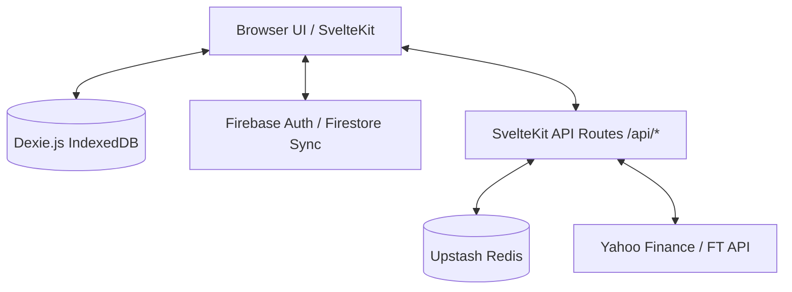

# CoreBalance Architecture

## System Overview
CoreBalance is a SvelteKit-based SPA/SSR hybrid application utilizing a local-first paradigm with optional Firebase sync.

## Client vs Server Boundaries
- **Client**: 
  - Layout & views (Svelte 5 Runes).
  - State management (local stores for active portfolios).
  - Local database storage (Dexie.js) containing transactions and allocations.
  - Authentication triggers (Firebase Auth).
- **Server**:
  - API Routes for fetching quotes (Yahoo Finance/Financial Times).
  - Upstash Redis cache backend for pricing API rate-limit management.
  - Server Hooks (`hooks.server.ts`) for localization and headers.

## Firebase Integration
- **Authentication**: Google Auth provider with session persistence (`browserLocalPersistence`).
- **Sync**: Optional cloud database mirroring for multi-device sync (Firestore). If API Key is missing, reverts gracefully to local-only mode.
